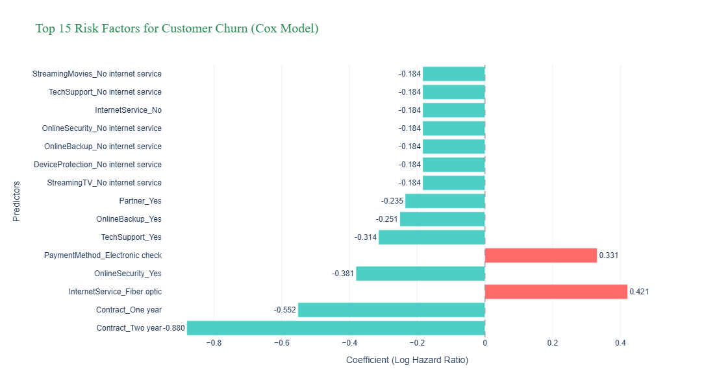

# Telco Customer Churn: Advanced Survival Analysis 📈

This project uses **Survival Analysis** to predict when customers are likely to churn and what factors influence their loyalty.

## 📊 Key Visualizations

### 1. The Power of Long-Term Contracts
.png)
*Insight: Two-year contracts drastically improve customer survival rates compared to month-to-month plans.*

### 2. Risk Factor Analysis (Cox Hazard Ratios)
.png)
*Insight: This chart quantifies how features like Tech Support (reduces risk) and Fiber Optic (increases risk) impact the churn timeline.*

### 3. Service Segment Comparison

*Insight: Fiber optic customers show a unique churn pattern that requires specific retention strategies.*

## 🛠 Tech Stack
- **Python** (Lifelines, Scikit-Survival, Pandas, Plotly)
- **Models:** Kaplan-Meier Estimator, Cox Proportional Hazards
